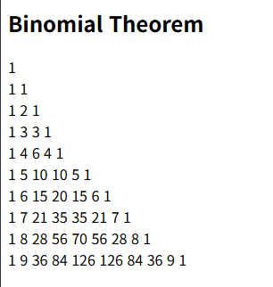

# OOP2026
### Homework1
```Java
public class Homework1{
  public static void main(String []args){
    int i, j;
    for(i=0; i<10; i++) {
      for(j=0; j<10; j++) {
        System.out.print("#");
      }
      System.out.println("");
    }
  }
}
```


### Homework5
```Java
var n = 10;
var binomial = [];

for (var i = 0; i < n; i++) {
    binomial[i] = [];
    for (var j = 0; j <= i; j++) {
        if (j === 0 || j === i) {
            binomial[i][j] = 1;
        } else {
            binomial[i][j] = binomial[i - 1][j - 1] + binomial[i - 1][j];
        }
    }
}

var result = "";
for (var i = 0; i < n; i++) {
    for (var j = 0; j <= i; j++) {
        result += binomial[i][j] + " ";
    }
    result += "<br>";
}
```

