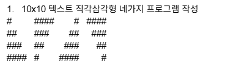

# OOP2026
### Homework1
```Java
public class Homework1{
  public static void main(String []args){
    int i, j;
    for(i=0; i<10; i++) {
      for(j=0; j<10; j++) {
        System.out.print("#");
      }
      System.out.println("");
    }
  }
}
```


### Homework2
```Java
public class Homework1{
  public static void main(String []args){
    int i, j;
    for(i=0; i<10; i++) {
      for(j=0; j<10; j++) {
        System.out.print("#");
      }
      System.out.println(""); ggg
    }
  }
}
```


### Homework３
```Java
public class HelloWorld {
    public static void main(String[] args) {
    	
    	long prev = 1;
        long curr = 1;
        
        for(int i = 2; i <= 20; i++) {
            long next = prev + curr;
            double ratio = (double) next / curr;
            System.out.printf("%d/%d=%.3f  ", next, curr, ratio);
            if((i - 1) % 4 == 0) {
                System.out.println();
            }
            prev = curr;
            curr = next;
        }
        System.out.println("\n");
    }
}
```


### Homework4
```Java
public class HelloWorld {
    public static void main(String[] args) {
    	for(int j = 1; j <= 9; j++) {
            for(int i = 1; i <= 9; i++) {
                System.out.print(i + "*" + j + "=" + (i * j) + "\t");
            }
            System.out.println();
        }
    }
}

```


### Homework5
```Java
public class HelloWorld {
    public static void main(String[] args) {
      
        int i;
     double j=0;
        int h=0;
  
        double a=0;
      
        for(i=1; i<1000;i++) {
        
        	if(i%2==1){
                
                j=4.0/(h*2+1);
                h++;
               a+=j;
               
                    
            }
            
        	if(i%2==0){
                
              j=4.0/(h*2+1);
                h++;
              a-=j;
                
                    
            }
            
        }
        
            System.out.printf("%.4f",a);
            
             
        	
    }
}
```


### Homework5-2
```Java
public class HelloWorld {
    public static void main(String[] args) {
      
        int i;
     double j=0;
        int h=0;
        double k=0;
        double a=0;
      
        for(i=0; i<1000;i++) {
        
        	if(i%2==0){
             k = Math.pow(3, i); 
                j=(1.0* Math.sqrt(12))/(k*(h*2+1));
                h++;
               a+=j;
               
                    
            }
            
        	if(i%2==1){
                 k = Math.pow(3, i); 
              j=(1.0* Math.sqrt(12))/(k*(h*2+1));
                h++;
              a-=j;
                
                    
            }
            
        }
        
            System.out.printf("%.4f",a);
            
             
        	
    }
}


```


### Homework6
```Java
var n = 10;
var binomial = [];

for (var i = 0; i < n; i++) {
    binomial[i] = [];
    for (var j = 0; j <= i; j++) {
        if (j === 0 || j === i) {
            binomial[i][j] = 1;
        } else {
            binomial[i][j] = binomial[i - 1][j - 1] + binomial[i - 1][j];
        }
    }
}

var result = "";
for (var i = 0; i < n; i++) {
    for (var j = 0; j <= i; j++) {
        result += binomial[i][j] + " ";
    }
    result += "<br>";
}

```


### Homework７
```Java
public class Helloworld {
    public static void main(String[] args) {

        int[] data = new int[20];

       
        for (int i = 0; i < 20; i++) {
            data[i] = (int)(Math.random() * 100);
        }

      
        for (int a = 0; a < data.length - 1; a++) {

            
            int min = a;

          
            for (int b = a + 1; b < data.length; b++) {
                if (data[b] < data[min]) {
                    min = b;
                }
            }

          
            int temp = data[a];
            data[a] = data[min];
            data[min] = temp;
        }

    
        for (int i = 0; i < data.length; i++) {
            System.out.println(data[i]);
        }
    }
}
```


### Homework８
```Java
public class helloworld {
    public static void main(String[] args) {

        int score[][] = new int[30][5];

       
        for (int i = 0; i < 30; i++) {
            for (int j = 0; j < 4; j++) {
                score[i][j] = (int)(Math.random() * 101);
            }
        }

     
        for (int i = 0; i < 30; i++) {
            score[i][4] = score[i][0]
                        + score[i][1]
                        + score[i][2]
                        + score[i][3];
        }

     
        System.out.println("번호\t국어\t영어\t수학\t과학\t총점");

        for (int i = 0; i < 30; i++) {
            System.out.printf("%d\t%d\t%d\t%d\t%d\t%d%n",
                    i + 1,
                    score[i][0],
                    score[i][1],
                    score[i][2],
                    score[i][3],
                    score[i][4]);
        }
    }
}
```


### Homework１０
```Java
public class Helloworld {
    public static void main(String[] args) {
        int arrayCount = 1000;
        int maxValue = 100;
        int binSize = 10;
        int displayScale = 5;
        if (args.length >= 4) {
            arrayCount = Integer.parseInt(args[0]);
            maxValue = Integer.parseInt(args[1]);
            binSize = Integer.parseInt(args[2]);
            displayScale = Integer.parseInt(args[3]);
        }

        int[] data = new int[arrayCount];

        for (int i = 0; i < arrayCount; i++) {
            data[i] = (int) (Math.random() * maxValue);
        }

        int binCount = (maxValue + binSize - 1) / binSize;
        int[] histogram = new int[binCount];

        for (int i = 0; i < arrayCount; i++) {
            int bin = data[i] / binSize;
            histogram[bin]++;
        }

        for (int i = 0; i < binCount; i++) {
            int start = i * binSize;
            int end = Math.min(start + binSize - 1, maxValue - 1);

            System.out.printf("%2d~%-2d\t", start, end);

            int count = histogram[i] / displayScale;

            for (int j = 0; j < count; j++) {
                System.out.print("#");
            }

            System.out.println();
        }
    }
}
```


### Homework１１
```Java
public class Calculator {
public static void main(String[] args) {    
		int array_count;
		if(args.length !=1)
			return;
		array_count = Integer.parseInt(args[0]);
		int[] arr = new int[array_count];
		for (int i=0; i<array_count; i++) {
			arr[i] = (int) (Math.random()*100);
		}
		for (int i=0; i<array_count; i++) {
			System.out.print(arr[i] + " ");  
		}
		System.out.println();
		double sum = 0;
		for (int i=0; i<array_count; i++) {
			sum+=arr[i];
		}
		System.out.printf("arithematic mean : = %f\n", sum/array_count);
		double prod = 1;
		for (int i=0; i<array_count; i++) {
			prod*=arr[i];
		}
		System.out.printf("geometric mean : = %f\n", Math.pow(prod, 1.0/array_count));
    double six =1;
    for (int i=0; i<array_count; i++){
        six+=1.0/arr[i];
        
    }  System.out.printf("hamonoic mean : = %f\n", array_count/six );
    int[] sortedArr = arr.clone();
        java.util.Arrays.sort(sortedArr);
        double median;
        if (array_count % 2 == 0) {
            median = (sortedArr[array_count / 2 - 1] + sortedArr[array_count / 2]) / 2.0;
        } else {
            median = sortedArr[array_count / 2];
        }
        System.out.printf("median           : = %f\n", median);
		
	}
}
```


### Homework１３
```Java
import java.util.Scanner;
public class miniCalculator {
  public static void main(String[] args) {
       Scanner scanner = new Scanner(System.in);
    while(true) {
    
      String inputString = scanner.nextLine();
      System.out.println(inputString);
      String[] arr = inputString.split(" "); 
      int result= Integer.parseInt(arr[0]);
        for(int i=1; i<arr.length; i+=2){
            String op=arr[i];
            int num = Integer .parseInt(arr[i+1]);
            if(op.equals("+"))result+=num;
             if(op.equals("-"))result-=num;
             if(op.equals("#"))result*=num;
             if(op.equals("/"))result/=num;
            
        }
      System.out.println(result);

		
	}
  }
}
```
